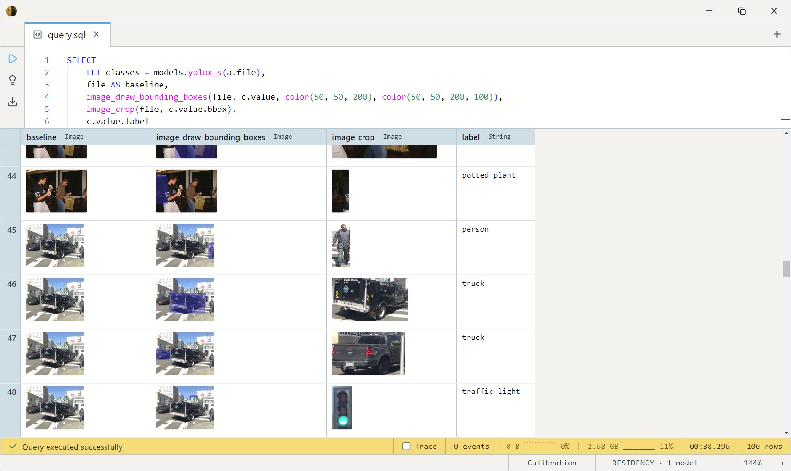

# YOLOX

Single-shot object detector from Megvii. Anchor-free, decoupled head,
SimOTA label assignment. Drop-in replacement for YOLOv5 with permissive
Apache-2.0 licensing and a wider quality/size ladder than most modern
YOLO forks ship.

All variants share the same architecture and the same `LabeledObjectDetector`
contract — they differ only in backbone depth and width. Pick a size,
not a model: every variant returns the same `Array<LabeledDetection>`
shape so swapping is a one-line change.

## When to use which variant

| Variant | Params | Best for                                                        |
| ------- | ------ | --------------------------------------------------------------- |
| Nano    | 0.9M   | Phones / edge devices. Fits in 4 MB.                            |
| Tiny    | 5.1M   | Edge with a few MB to spare. Big mAP jump over Nano.            |
| **S**   | 9.0M   | **Default** CPU pick. Best quality-per-MB on commodity laptops. |
| M       | 25.3M  | CPU-viable, GPU-fast. The "I want quality without bulk" choice. |
| L       | 54.2M  | GPU-only. Sharper on small / crowded objects than M.            |
| X       | 99M    | GPU + accuracy-critical. Fewest false positives in the family.  |
| Darknet | 63.7M  | Reproducibility / paper comparison only. M / L usually beat it. |

Start with **S** for new projects. Move up only after profiling shows
detection quality (not latency) is the bottleneck.

## Example SQL

Detect objects in the coco 2017 validation dataset:

```sql
SELECT
    LET classes = models.yolox_s(a.file),
    file AS baseline,
    image_draw_bounding_boxes(file, classes)
FROM datasets.coco_val2017 a
LIMIT 100
```

Unnest detections into rows (one per box):

```sql
SELECT
    LET classes = models.yolox_s(a.file),
    file AS baseline,
    image_draw_bounding_boxes(file, c.value, color(50, 50, 200), color(50, 50, 200, 100)),
    image_crop(file, c.value.bbox)
FROM datasets.coco_val2017 a
CROSS JOIN unnest(classes) c
LIMIT 100
```

Output:



Filter to a single class (people):

```sql
SELECT
    LET classes = models.yolox_s(a.file),
    file AS baseline,
    image_draw_bounding_boxes(file, c.value),
    image_crop(file, c.value.bbox)
FROM datasets.coco_val2017 a
CROSS JOIN unnest(classes) c
WHERE c.value.label = 'person'
LIMIT 100
```

## Output shape

Every variant returns `Array<LabeledDetection>`:

```
bbox:  BoundingBox -- {x, y, w, h} in pixel coordinates
label: String      -- COCO class name (e.g. "person", "car")
score: Float32     -- 0.0–1.0 confidence
```

`UNNEST` exposes each element as a single `value` column, so field
access is `value.label` / `value.score` / `value.bbox` (as in the
examples above).

The 80 COCO categories are the standard set — see the
[COCO label list](https://github.com/amikelive/coco-labels) for the
full vocabulary.

## Screenshots

<!--
Drop images in this folder (models/cards/yolox/) and reference them
with a sibling relative path. Example:


-->

## Tips

- **Coordinates are pixels in the input image** — no normalization. If
  you resize before detection, scale boxes back yourself.
- **No NMS knob in v1** — internal NMS uses the standard IoU=0.65
  threshold. Aggressive overlap handling lives in a follow-up.
- **Class confidence is a product** of objectness × class probability.
  A score of 0.5 is meaningful; below 0.3 is mostly noise.

## License & attribution

Apache-2.0. Original implementation by Megvii (the YOLOX team). ONNX
export and re-host on HuggingFace under `Heliosoph`.

- Paper: [YOLOX: Exceeding YOLO Series in 2021](https://arxiv.org/abs/2107.08430)
- Source: [Megvii-BaseDetection/YOLOX](https://github.com/Megvii-BaseDetection/YOLOX)
