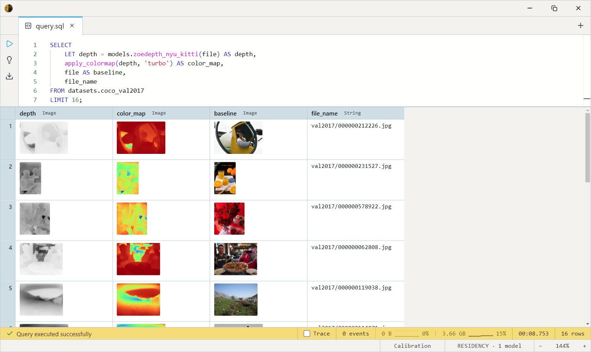
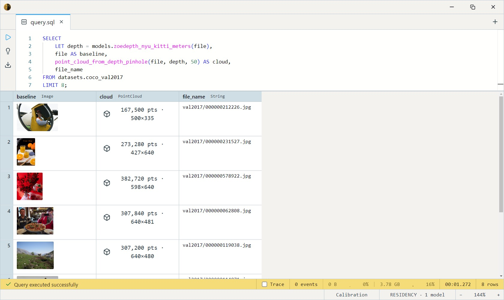

# ZoeDepth (NYU+KITTI, Metric Depth)

Intel ISL's ZoeDepth — a DPT-Large relative-depth backbone fitted with
**dual metric heads** (NYU indoor + KITTI outdoor calibration) that emit
depth in **real metres**. The specialist metric estimator: when the scene
is strictly indoor or driving-style outdoor, its calibrated heads beat the
more general [DA3 Metric Large](../da3metric-large/index.md).
MIT-licensed.

Reach for it when absolute scale matters — 3D reconstruction with
consistent scale across images, AR distance overlays, robotics — and the
scene fits one of its two trained domains.

## Variants and output models

Two precision builds, each with a visualization and a raw-metres body —
`zoedepth_nyu_kitti[_fp16][_meters]`:

| Variant | Disk    | Models                                                          |
| ------- | ------- | -------------------------------------------------------------- |
| **fp32**| ~1.3 GB | `zoedepth_nyu_kitti`, `zoedepth_nyu_kitti_meters`             |
| fp16    | ~660 MB | `zoedepth_nyu_kitti_fp16`, `zoedepth_nyu_kitti_fp16_meters`   |

| Suffix    | Returns          | Use                                          |
| --------- | ---------------- | -------------------------------------------- |
| *(none)*  | `Image`          | Grayscale depth map for viewing.             |
| `_meters` | `Array<Float32>` | Raw metres per pixel, source-aligned, for geometry. |

Both builds are CPU-runnable; fp16 halves the disk with the same output on
fp16-native runtimes.

## Example SQL

COCO 2017 val is images-only — `file` is the decoded JPEG, `file_name`
its path.

Depth-map visualization, false-coloured:

```sql
SELECT
    LET depth = models.zoedepth_nyu_kitti(file) AS depth,
    apply_colormap(depth, 'turbo') AS color_map,
    file AS baseline,
    file_name
FROM datasets.coco_val2017
LIMIT 16;
```

Output:



Unproject real metres into a metric point cloud — pinhole projection is
correct when depth is in real distances:

```sql
SELECT
    LET depth = models.zoedepth_nyu_kitti_meters(file),
    file AS baseline,
    point_cloud_from_depth_pinhole(file, depth, 50) AS cloud,
    file_name
FROM datasets.coco_val2017
LIMIT 8;
```

Output:



## Output shape

- `zoedepth_nyu_kitti` → `Image`, grayscale, **brighter = closer** (the
  body inverts since metric depth is bigger = farther), resized to the
  source dimensions. The grayscale pack does a per-image min-max rescale,
  so **this Image discards the metric units** — it's visualization only.
- `zoedepth_nyu_kitti_meters` → `Array<Float32>`, per-pixel metres,
  bilinear-resized to align 1:1 with the input (interpolation is linear,
  so metric units survive the resize).

## Tips

- **Use `_meters` for any real-world math.** The plain visualization
  variant throws away absolute units in its min-max rescale; only the
  `_meters` body carries true metres.
- **Stay in-domain.** The two heads are calibrated for NYU-style indoor
  and KITTI-style driving scenes. On out-of-distribution photos (faces,
  mixed lighting) the dual-head router can produce patchy results — for
  arbitrary scenes prefer [DA3 Metric Large](../da3metric-large/index.md).
- **Pinhole, not orthographic.** Real metres → `point_cloud_from_depth_pinhole`
  gives honest geometry; orthographic curves flat planes into hills.
- **384×384 input**, ImageNet mean/std, handled inside the body — pass
  the raw `Image` column straight in. (It shares DPT-Large's backbone.)

## License & attribution

MIT. Original model by Intel ISL (ZoeDepth — Bhat, Birkl, Wofk, Wonka,
Müller); ONNX export re-hosted on HuggingFace under `Heliosoph`.

- Upstream: [isl-org/ZoeDepth](https://github.com/isl-org/ZoeDepth)
- Paper: [ZoeDepth: Zero-shot Transfer by Combining Relative and Metric Depth](https://arxiv.org/abs/2302.12288)
